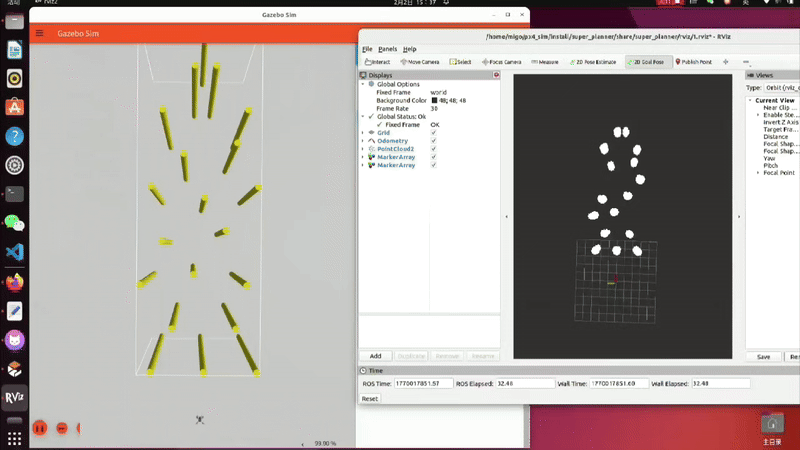

PX4 & ROS2 无人机自主飞行系统

本项目是一个基于 ROS2 Humble 和 PX4 的无人机仿真与导航框架，实现了从感知、里程计到路径规划与控制的全流程闭环。

🌿 分支说明 (Branches)

项目目前维护两个核心分支，分别对应不同的应用场景：

main 分支：采用 EGO-Planner 的常规导航模式，飞行轨迹平滑稳定，适用于大多数通用场景。

fast 分支（推荐）：采用更激进的 Super-Planner，极大提升了复杂地形下的避障速度，并在 px4_ctrl 中集成了闭环控制算法。

📺 快速演示 (Fast Branch Demo)

当前分支：fast 展示了无人机在复杂障碍物环境下的高速穿梭性能。

🛠 1. 环境依赖 (Prerequisites)

在运行本项目前，请确保您的开发环境已配置以下核心组件：

组件	版本	说明

操作系统	Ubuntu 22.04 LTS	推荐系统版本

ROS2	Humble Hawksbill	机器人操作系统

仿真引擎	Gazebo Harmonic	配合 PX4 使用的仿真环境

通信中间件	Micro-XRCE-DDS	用于 PX4 与 ROS2 的高速数据交换

📂 2. 核心模块说明 (Modules)

项目工作空间包含以下关键功能包：

    gz_ros_plugin: 桥接层，负责将 Gazebo 中的传感器数据转换为 ROS2 标准话题。

    small_point_lio: 轻量化激光惯性里程计，提供高精度位姿数据。

    visual_odom_bridge: 转换插件，将 LIO 位姿转化为 PX4 外部定位数据 (External Vision)。

    ego_ros2: 核心规划器，基于 EGO-Planner 生成平滑避障路径。

    px4_ctrl: 控制节点，将规划指令封装为 Offboard 指令发送给飞控。

    key.py: 交互脚本，通过终端键盘快速发送指令。

🚀 3. 运行指南 (Execution Guide)

请按照以下顺序在不同的终端窗口中启动节点：

第一步：启动 SLAM 与里程计

解析雷达数据并建立实时里程计。

ros2 launch small_point_lio small_point_lio.launch.py

第二步：启动定位转接 (Odom Bridge)

将里程计反馈给 PX4 飞控，实现外部定位闭环。

ros2 run visual_odom_bridge visual_odom_bridge

第三步：启动规划器与可视化

启动规划算法及 Rviz2 实时监控界面。

# 启动规划节点
ros2 launch ego_planner single_uav_gazebo.launch.py

# 启动 Rviz 可视化
ros2 launch ego_planner rviz.launch.py

第四步：启动控制与交互

启动控制逻辑并使用键盘脚本接管无人机。

# 1. 启动控制节点

ros2 run px4_ctrl offboard_control

# 2. 运行键盘控制脚本

python3 key.py

🎮 4. 指令交互 (Command Table)

在运行 key.py 的终端中，使用以下快捷键控制无人机：

按键	功能描述	动作说明

t	Takeoff	自动解锁、起飞并进入悬停状态

o	Offboard	切换至 Offboard 模式，开始执行规划路径

l	Land	触发自动着陆程序

💡 小贴士

    确保在启动任何节点前，MicroXRCEAgent 已经成功连接。

    如果在 fast 分支运行，请确保 px4_ctrl 参数已针对高速飞行完成调优。
